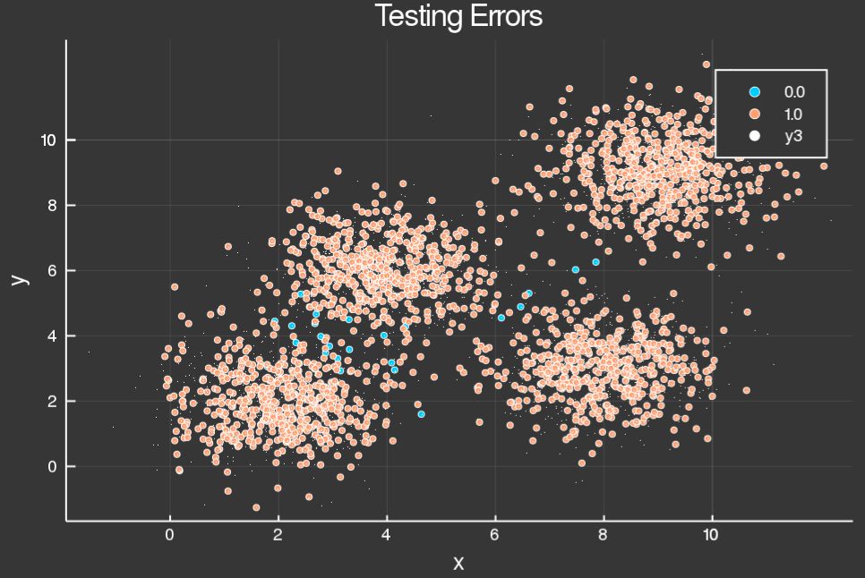

# support_vector_machine
svm.jl</br>
Sequential minimal optimization for support vector machine. </br>
Support vector machine for binary and multi class (one vs one strategy) classification.</br>
Only radial basis function kernel for now.</br>

Goal is to implement in as pure Julia possible. </br>

If you aren't expert in lagrangian arithmetics (I'm not), this is a great ressource to get started with SMO.</br>
 http://cs229.stanford.edu/materials/smo.pdf
 
 
<strong>How to use :</strong></br>

<strong>1. Binary classification</strong>
```julia
# xx are our features, yy our labels ( 1 or -1 )

# β = binaryβ(x::Array{Float64,2}, y::Vector{Int64}, classpos::Int64, classneg::Int64, splitα::Float64, mi::Int64, mp::Int64, k::String, c::Float64, γ::Float64)

# x = training features
# y = training labels
# classpos = used for multi class. Use 1
# classneg = used for multi class. Use -1
# splitα = ratio of training / (training + testing)
# mi = max iteration for smo
# mp = max smo loop without change to tolerance
# k = kernel type. For now, only "rbf" (radial basis function kernel)
# c = regularization parameter
# γ = RBF kernel parameter

binaryModel = binaryβ(xx, yy, 1, -1, 0.5, 1000, 1000, "rbf", 0.6, 0.1)
```
<strong>2. Multi class classification</strong>
```julia
iris = dataset("datasets", "iris")

mapping = multiClassPreprocess(iris) # some pre processing to data
y = vec(convert(Array, mapping[:,1])) # get labels
x = convert(Array, mapping[:,2:5]) # get features
x_train, y_train, x_test, y_test = splitTestTrain(x, y, 0.5) # split first time for fresh unseen data

models, labels = βbattleground(x_train, y_train, 0.9, 1000, 1000, "rbf", 0.6, 0.001) # feed xtrain into one vs one method
print(labels) # check our labels
predictions = kaloskagathing(models, x_test, labels) # check our prediction on xtest
accu = computeAccuracy(predictions, y_test)

```
<strong>3. Grid search</strong>
```julia
# xx are our features, yy our labels

binaryModel = binaryβ(xx, yy, 1, -1, 0.5, 1000, 1000, "rbf", 0.6, 0.1)
models = gridSearch(xx, yy, 0.5, 1000, 1000, "rbf")


```

<strong>Classification results on random clusterised data points :</strong>

White dots = training data<br/>
Blue markers = testing data failure<br/>
Orange markers = testing data success<br/>

<br/>

<strong>How it works :</strong></br>

<strong>1. Sequential minimal optimization</br></strong>
http://cs229.stanford.edu/materials/smo.pdf

```julia
function smo!(β::SVM)
    m = size(β.x, 1)
    for i = 1:m
        # does rbf betzeen all rows of features into columns of K
        β.k[:,i] = kernel(β.x, β.x[i,:], β)
    end

    passes = 0
    while passes < β.max_passes

        Δα = 0

        for i = 1:m

            Ei = computeError(i, β)

            if (β.y[i] * Ei < -β.tol && β.α[i] < β.c) || (β.y[i] * Ei > β.tol && β.α[i] > 0)

                j = rand(1:m)
                if j == i
                    j = rand(1:m)
                end

                L, H = computeBounds(i, j, β)
                L == H && continue

                η = 2.0 * β.k[i, j] - β.k[i, i] - β.k[j, j]
                η >= 0 && continue

                Ej = computeError(j, β)

                α_io, α_jo = β.α[i], β.α[j]

                β.α[j] -= (β.y[j] * (Ei - Ej)) / η
                β.α[j] = clamp(β.α[j], L, H)

                abs(β.α[j] - α_jo) < β.tol && continue

                β.α[i] = β.α[i] + β.y[i] * β.y[j] * (α_jo - β.α[j])

                b1 = β.b - Ei - β.y[i] * (β.α[i] - α_jo) * β.k[i, i] -
                     β.y[j] * (β.α[j] - α_jo) * β.k[i, j]
                b2 = β.b - Ej - β.y[j] * (β.α[j] - α_jo) * β.k[j, j] -
                     β.y[i] * (β.α[i] - α_io) * β.k[i, j]

                if 0 < β.α[i] < β.c
                    β.b = b1
                elseif 0 < β.α[j] < β.c
                    β.b = b2
                else
                    β.b = 0.5 * (b1 + b2)
                end

                Δα += 1

            end

            if Δα == 0
                passes += 1
            else
                passes = 0
            end

        end

        β.sv_pos = findall(β.α .> 0)

    end
end
```
<strong>2. One Vs One strategy for multi classification</br></strong>

Converts the multi classification task into several binary classifications ones.</br>

There are n * (n - 1) / 2 binary matchups for n labels.</br>

```julia
function βbattleground(x::Array{Float64,2}, y::Vector{Int64}, splitα::Float64, mi::Int64, mp::Int64, k::String, c::Float64, γ::Float64)

    n = length(unique(y))
    labels = [i for i in unique(y)]
    binaries = combinations(1:n, 2)
    #nmodels = trunc(Int, n * (n-1) / 2) == length(binaryMaps)

    βs = Array{BinaryModel, 1}(undef, length(binaries))

    idx = 1
    for binary in binaries
        c1 = binary[1]
        c2 = binary[2]

        sidx = findall(x->x ∈ [c1, c2], y)

        xi = x[sidx,:]
        d = Dict([ labels[c1] => 1, labels[c2] => -1])
        yi = getindex.(Ref(d), y[sidx])

        βs[idx] = binaryβ(xi, yi, c1, c2, splitα, mi, mp, k, c, γ)

        idx += 1
    end

    return βs, labels
end
```
<strong>3. Multi class voting following One Vs One strategy: </br></strong>

The class with the most votes wins.</br>


    'Kalos kagathos or kalokagathos (Ancient Greek: καλὸς κἀγαθός [kalòs kaːɡatʰós]),
    of which kalokagathia (καλοκαγαθία) is the derived noun, is a phrase used
    by classical Greek writers to describe an ideal of gentlemanly personal conduct,
    especially in a military context.'</br>
    https://en.wikipedia.org/wiki/Kalos_kagathos</br>
        

```julia
function kaloskagathing(βs::Array{BinaryModel, 1}, x_test::Array{Float64, 2}, classIdx::Array{Int64, 1})
    kalokagathos = Array{Int64, 2}(undef, size(x_test, 1), length(βs))

    for i in 1:length(βs)
        p = predict(x_test, βs[i].β)

        replace!(p, 1 => βs[i].classpos)
        replace!(p, -1 => βs[i].classneg)
        kalokagathos[:,i] = p
    end

    kalokagathos = mapslices(x->countmemb(x), kalokagathos, dims=2)

    kalokagathos = findmax.(kalokagathos)

    kalokagathos = [(kalokagathos...)...]

    i = 2:2:length(kalokagathos)

    return kalokagathos[i]
end
```

